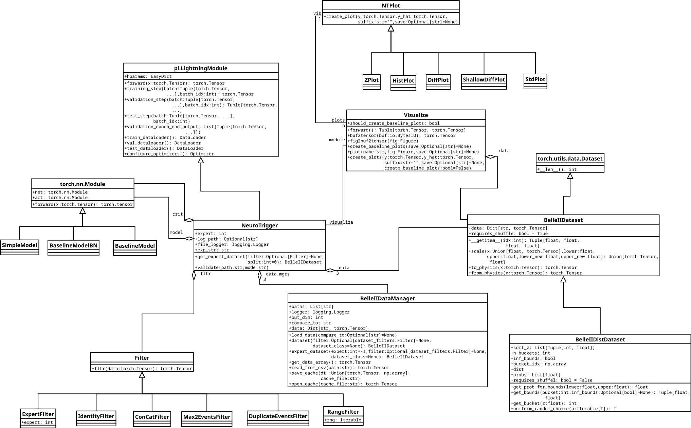
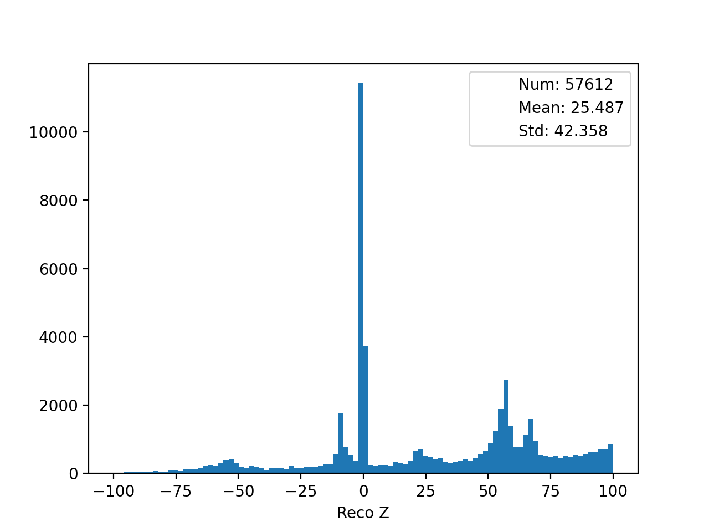
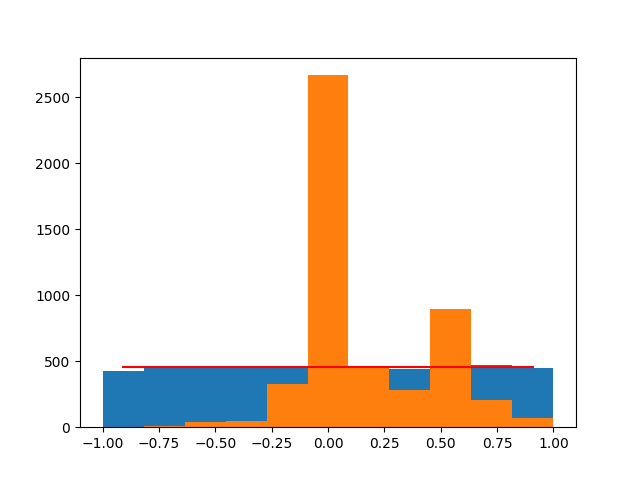
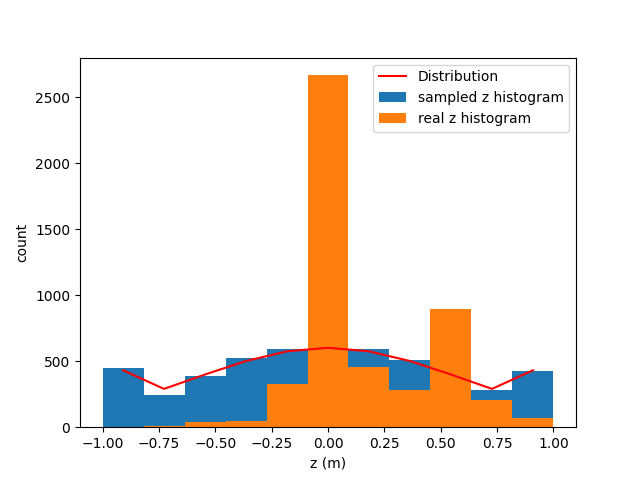
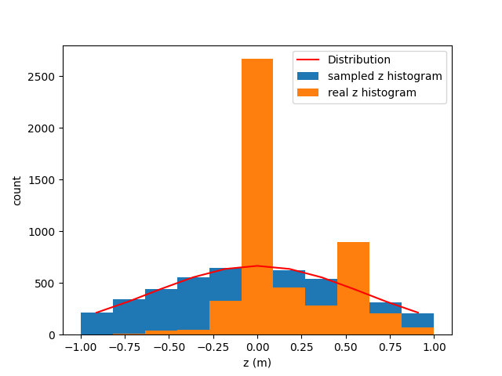

# Documentation of the PyTorch NeuroTrigger Trainer

<!-- vscode-markdown-toc -->
* 1. [Introduction](#Introduction)
* 2. [Cloning and Setup](#CloningandSetup)
* 3. [Start a Training](#StartaTraining)
* 4. [Debug Trainings](#DebugTrainings)
* 5. [Tests](#Tests)
* 6. [Log](#Log)
	* 6.1. [Opening Tensorboard](#OpeningTensorboard)
* 7. [Config](#Config)
	* 7.1. [Example Configurations](#ExampleConfigurations)
* 8. [Extensibility](#Extensibility)
	* 8.1. [Software Architecture](#SoftwareArchitecture)
	* 8.2. [Project Folder Structure](#ProjectFolderStructure)
	* 8.3. [Dataset API](#DatasetAPI)
	* 8.4. [Visualization](#Visualization)
	* 8.5. [Filtering](#Filtering)
	* 8.6. [Model](#Model)
	* 8.7. [Feed-Down/Up Problem and Reweighting](#Feed-DownUpProblemandReweighting)
		* 8.7.1. [Uniform Distribution](#UniformDistribution)
		* 8.7.2. [Normal Distribution](#NormalDistribution)
* 9. [Results](#Results)

<!-- vscode-markdown-toc-config
	numbering=true
	autoSave=true
	/vscode-markdown-toc-config -->
<!-- /vscode-markdown-toc -->


<!-- ##  1. <a name='Outline'></a>Outline
- How to use the tool, start trainings, look at tensorboard, evaluate trainings
- how log is structured
- config keys in detail
- overall software architecture with class diagram
- dataset api, how should the dataset look
- future plans
- how do specific bits work: weight sampler, filter, training of experts, logging/tensorboard -->

##  1. <a name='Introduction'></a>Introduction
- idea of the trigger
- why a rewrite was important


##  2. <a name='CloningandSetup'></a>Cloning and Setup
Note that this setup is only meant for Linux-based system. Other OSes are currently not supported.

In order to clone the repository use the following command:
```bash
git clone git@stash.desy.de:7999/b2nnt/nnt-pytorch.git neuro-trigger-v2
```
Then `cd` into the repository, create a python virtual environment:
```bash
cd neuro-trigger-v2
virtualenv venv --python=python3.8
```
Activate the virtual environment and install the dependencies:
```bash
source venv/bin/activate
pip install -r requirements.txt
```
If you later want to deactivate the virtual environment type `deactivate`.

##  3. <a name='StartaTraining'></a>Start a Training
In order to start a training one first needs to define or choose a training configuration in [`neuro_trigger/configs.py`](neuro_trigger/configs.py). How to do this will be discussed in section [Config](#Config).
There are several configurations which are already defined. For example `baseline_v2` which is the baseline network from BASF2.
To train it run the following commands inside the `neuro_trigger` folder:
```shell
# activate the virtual environment if you haven't already
source venv/bin/activate
# set the python path
export PYTHONPATH="$PYTHONPATH:."
# execute a training
python neuro_trigger/main.py baseline_v2 -p
```
The `-p` argument stands for production and means that no debugging is currently performed. This will ask you to provide a short description for your
experiment to let you remember it easier and then it will start training with the parameters specified in the configuration that was passed as the first argument.


`main.py` is the main entry point for each training and has a minimal CLI which supports the following arguments:
TODO: remake
```bash
usage: main.py [-h] [-p] mode

Tool to start the neuro trigger training.

positional arguments:
  mode              config mode to use, must be defined in config.py

optional arguments:
  -h, --help        show this help message and exit
  -p, --production  if not given code will run in debug mode
```
The main purpose of this CLI is to pass the configuration that one wants to use for the training.


##  4. <a name='DebugTrainings'></a>Debug Trainings

In order to launch a debug training you can just leave out the `-p` argument. Doing so will also result no description prompt:
```shell
# debug run:
# activate the virtual environment if you haven't already
source venv/bin/activate
# set the python path
export PYTHONPATH="$PYTHONPATH:."
# execute a training
python neuro_trigger/main.py baseline_v2
```
The difference compared to production trainings is that the debug training per default only uses one expert. This is useful for debugging
as we only have a single thread where we can concentrate. The other difference is that the log folder is located under `/tmp/nt_pytorch_debug_log/<config_name>/version_x` instead of in the `log` folder.

If you use VSCode for development and debugging you can also go into the "Run and Debug" tab where you will find two run configurations: one for training called "Training" and one for testing called "Tests".

The run configurations are defined in the `.vscode`. They will automatically configure the path and virtual env correctly.
They also support debugging breakpoints set in VSCode.

The "Training" run configuration uses `normal_distribution` as pre-set config. However, this can easily be changed in [`.vscode/launch.json`](.vscode/launch.json) under `args`.


##  5. <a name='Tests'></a>Tests

The project also supports the execution of unit tests. The tests are defined in [`neuro_trigger_tests/test.py`](neuro_trigger_tests/test.py). Every method starting with `test_` in a class sub classing from `unittest.TestCase` will be executed.

Note that running the tests can take a few minutes as some end-to-end tests take quite a bit of time
to finish.
To execute the tests run the following command:
```shell
python neuro_trigger/tests/test.py
```
As for the debug trainings, there is also a VSCode run configuration in [`.vscode/launch.json`](.vscode/launch.json) which allows you to run and debug the tests
in VSCode's "Run and Debug" tab. The configuration is named "Tests".


TODO: Explain unit test framework?


##  6. <a name='Log'></a>Log

Each training will create a log folder which one can find under the following path for production trainings:
```shell
log/<config name e.g. baseline_v2>/version_x
```
Furthermore, every production run is recorded with its log folder path and a timestamp in `log/log.txt`.

You will find the following files in experiment log folder:
- `expert_x.log`: log/debug output of the respective expert
- `app.log`: log/debug output of the whole training which includes the output of all experts.
- `git_diff.txt`: git diff / git patch file of the current changes in the git repository.
- `git_id.txt`: git commit id from the last commit.
- `summary.json`: Json file which contains the hyper parameters, git diff and if the training has finished also the train, validation and test losses and further metrics of each expert. These metrics can for example be used to easily compare the performance of several trainings.
- `expert_x` folder

If the training has already finished, the following files will also be in the log directory:
- `weights.json`: Json file which includes the weights of all experts
- `pred_data_randomx.csv`: CSV file of the dataset for random1 to random3 with `ScaleZ`, `RawZ`, `ScaleTheta` and `RawTheta` replaced by the output of the trained experts.
- `prediction_randomx.pt`: pytorch binary format file which includes the prediction outcome of the dataset random1 to random3 with the trained experts.

Furthermore, each expert has its own log folder named `expert_x`. In this folder the following sub folders can be found:
- `ckpts`: The checkpoint folder includes checkpoints of this experts training weights. `last.ckpt` is the state of the weights after training has finished and `epoch=xxx-step=xxxxxx.ckpt` is a snapshot of the weights where the expert showed its peak performance according to the validation loss.
- `csv/version_0`: Metrics are logged in CSV form in `metrics.csv`. Logs are created every x iterations and every epoch. Some metrics are only calculated every epoch, that's why some values are missing for some entries. The folder also includes `hparams.yaml` which includes the hyperparameters for the expert.
- `tb/version_0`: Tensorboard folder. `events.out.tfevents.xxx` contains all tensorboard data, thus this file must be opened when using tensorboard. It will be updated during the training process. The folder also contains a `hparams.yaml` which contains the same hyperparamters as in the csv folder.

When the training has finished the expert specific log folder also contains a `result.json` which contains the following metrics: loss, loss_old, val_loss_vs_old_loss and val_z_diff_std. These metrics show the experts performance in a numeric way. There will also be a folder named `post_training_plots` which contains the same plots which are also pushed to tensorboard but after training in an image format.

###  6.1. <a name='OpeningTensorboard'></a>Opening Tensorboard
Tensorboard should already be installed in your virtual environment. If not install it using
```shell
pip3 install tensorboard
```
You can either open a single tensorboard file or a folder which contains several tensorboard files. In the latter case tensorboard will give a selection list of all training files it found.

Example for a single file:
```shell
python3 -m tensorboard --logdir=. log/baseline_v2/version_7/expert_0/tb/version_0/events.out.tfevents.1656581096.belleserv01.2510181.1
```
Example for a whole folder:
```shell
python3 -m tensorboard --logdir=. log/baseline_v2/version_7
```

Tensorboard will open a webserver where it will display the recorded metrics. In order to set host ip and port use the `--host` and `--port` arguments.

Often tensorboard will not be running on the local machine but on a remote host. In that case port forwarding (also supported in the GUI of visual studio code) can be very useful.
For basic SSH port forwarding use the following command (forwards local port 6000 to port 6006 on the server which is tensorboard default port):
```shell
 ssh -L 6000:localhost:6006 user@ssh-host.de
```

In this example the tensorboard website can then be opened in any browser under the following address: [localhost:6000](localhost:6000)


##  7. <a name='Config'></a>Config
(TODO: should also be possible to hand over a handcrafted config python dictionary)
A training is usually configured using `configs` dictionary in the [configs.py](neuro_trigger/configs.py) file.
A configuration is represented by an entry in the dictionary.
The key should be a string which describes the training's configuration.
This key can later be used in [main.py](neuro_trigger/main.py) as described in the section [Start a Training](#StartaTraining) to run a training with the specified config.

Following configuration items are supported:
* `version` (float): Version number of the training.
* `description` (str): A textual description of the config.
* `learning_rate` (float): Learning rate for the provided optimizer.
* `batch_size` (int): Batch size for each expert.
* `weight_decay` (float): L2 regularization for supported optimizers.
* `in_size` (int): Input size of the network, currently only 27 is supported.
* `out_size` (int): Network's output size. Currently supported are 2 and 1. 2 means that both z and theta are trained on and 1 means that the network is only trained on **z**.
* `workers` (int): Worker processes for dataloading. As the dataset is rather small in our usecase this should rather be a conservative number e.g. less than five.
* `epochs` (int): For how many epochs should each expert train.
* `model` (str): Network model to use. Model strings are defined in [__init__.py](neuro_trigger/__init__.py).
* `loss` (str): Loss function to use for the training. Loss function strings are defined in [__init__.py](neuro_trigger/__init__.py).
* `optim` (str): Optimizer class to use. Optimizer string definitions are defined in [__init__.py](neuro_trigger/__init__.py) and [lightning/pl_module.py](neuro_trigger/lightning/pl_module.py) in function `configure_optimizers`.
* `act` (str): Activation function that should be used in the model. The activation function strings are defined in [__init__.py](neuro_trigger/__init__.py).
* `experts` (List[int]): This list defines which experts one wants to train. For example `[0, 1, 2, 3, 4]` means to train all experts and `[1]` means to only train the expert 1. There is one special case: `[-1]` means to train the data of all experts in one big training, so there will be no expert differentiation then. This is mostly used for debug purposes as there is less multi threading involved in that case.
* `compare_to` (Optional[str]): Path to the log folder of a previous training to which one wants to compare this training. This is used for metrics which for example compare the loss of the current training to a loss of an old training. It is assumed that all trainings are located in a folder called `log`. Thus the path should be relative to this log-folder. For example one wants to compare to the training which has its log file in `log/baseline_v2/version_3` then `compare_to = "baseline_v2/version_3"`. Default `None` which compares to the old training values hard coded into the dataset.
* `load_pre_trained_weights` (Optional[str]): Every training saves the trained weights into a `weights.json`. This option allows to load theses weights and continue training from them instead of reinitializing the weights again. The passed string should be the path to the respective json file e.g. `log/baseline_v2/version_7/weights.json`. Default is `None` which means that the weights are randomly initialized.
* `filter` (str): Filter that should be applied to the dataset. Filters are defined in [pytorch/dataset_filters.py](neuro_trigger/pytorch/dataset_filters.py). To specifiy the filters one has to use valid python code that produces objects of the classes defined in `dataset_filters.py`. Examples:
  * `dataset_filters.DuplicateEventsFilter()`
  * `dataset_filters.ConCatFilter([dataset_filters.Max2EventsFilter(), dataset_filters.DuplicateEventsFilter()])`
* `dist` (Dict): Used for reweighted datasampling as described in Section [Feed-Down/Up Problem and Reweighting](#Feed-DownUpProblemandReweighting). It splits the z-interval into `n_buckets` and samples the training batches according to a given stocastical distribution out of the buckets. This configuration item consists of a dictionary itself with the following items:
  * `n_buckets` (int): How many buckets shall be used for the distribution.
  * `inf_bounds` (bool): Whether the distribution should continue beyond the lower most bucket to -inf and upper most bucket to inf. This has the side effect that these buckets have a slightly higher probability in the normal distribution as they should have as they include the edge probabilities. When set to False the edge which is not contained in the buckets is excluded and probabilities are normalized. Defaults to False.
  * Distribution type, supported are `norm` and `uniform`.
    * `norm` is a normal distribution. It self is again a dictionary with the following supported parameters:
      * `mean` (float): Mean of the normal distribution
      * `std` (float): Standard deviation of the normal distribution
    * `unform` is a uniform distribution. It self is again a dictionary with the following supported parameters:
      * `lower` (float): lower bound of the normal distribution
      * `upper` (float): upper bound of the normal distribution
  * Examples can be seen in the section below.
* `expert_x` (Dict): where `x` is element of {0, 1, 2, 3, 4} allows to set configuration parameters for specific experts. The parameters can be any of the ones mentioned before. If a parameter is configured twice then this value will overwrite the global value.
* `extends` (str): Training configs have the concept inheritance, this means that once you extend a config, all parameters are inherited from that config. If parameters are configured twice the extending config will overwrite the parameters. The `extends` parameters specifies from which configuration this configuration should inherit. Inheritance is recursive which means that the configuration from which you are inheriting might also inherit from another configuration. This allows us to specify a base configuration which contains the default parameters.


TODO: per expert overwrite, concept of inheritance and base log
TODO: how does random initialization work

###  7.1. <a name='ExampleConfigurations'></a>Example Configurations

```python
configs = {
    "base": {
        "version": 0.2,
        "description": "Base version to inherit from",
        "learning_rate": 1e-3,
        "batch_size": 2048,
        "weight_decay": 1e-6,
        "in_size": 27,
        "out_size": 2,
        "workers": 5,
        "epochs": 10,
        "model": "BaselineModel",
        "loss": "MSELoss",
        "optim": "Adam",
        "act": "relu",
        "experts": [0, 1, 2, 3, 4],
        "compare_to": None,
        "load_pre_trained_weights": None,
    }
    "reweight_normal": {
        "extends": "base",
        "compare_to": "baseline_v2/version_4",
        "description": "Normal reweighting",
        "dist": {
            "n_buckets": 11,
            "inf_bounds": False,
            "norm": {
                    "mean": 0,
                    "std": 0.4,
                },
            },
        "act": "tanh/2",
        "epochs": 1000,
        "expert_3": {
            "batch_size": 128,
            "epochs": 2000,
        },
        "expert_4": {
            "batch_size": 16,
            "epochs": 4000,
        },
    },
    "reweight_uniform": {
        "extends": "reweight_normal",
        "description": "Uniform reweighting",
        "dist": {
            "n_buckets": 11,
            "uniform": {
                    "lower": -1,
                    "upper": 1,
                },
            },
        "filter": "dataset_filters.DuplicateEventsFilter()",
    },
}
```

##  8. <a name='Extensibility'></a>Extensibility

###  8.1. <a name='SoftwareArchitecture'></a>Software Architecture
The overall software architecture is shown as a class diagram in the following figure.



There are three pre build ways to extend the architecture in an easy manner:
- add new tensorboard plots
- add new dataset filters
- add new neural network models
All of these extension ways will be discussed in detail in the following sections.

TODO: specific parts and general flow


###  8.2. <a name='ProjectFolderStructure'></a>Project Folder Structure
The repository is structured in the following way:
The folder [docs](docs) contains files relevant for this readme documentation such the UML diagram.
[.vscode](.vscode) contains configuration files for the development in visual studio code.
[changelog.md](changelog.md) contains already implemented and planned features which should be realized in specific release versions.
[requirements.txt](requirements.txt) contains the python dependencies for the python code.
[neuro_trigger](neuro_trigger) is the python module which contains the actual python code.
It self is split into
- the [lightning module](neuro_trigger/lightning) which contains code that uses pytorch lightning features such as the pytorch lightning module
- the [pytorch module](neuro_trigger/pytorch) which contains pytorch relevant code such as the network models or the dataloader
- the [test module](neuro_trigger/test) which contains tests code in order to quickly check for easy-to-find bugs
Furthermore, the neuro_trigger also contains the [config.py](neuro_trigger/config.py) file which contains all training configs that can be used for training the neuro trigger. The [main.py](neuro_trigger/main.py) which contains the command line interface and code to start the training.
The [utils.py](neuro_trigger/utils.py) contains helper functions and that like.
Fiannly, the [visualize.py](neuro_trigger/visualize.py) contains code for the plots send to tensorboard.

###  8.3. <a name='DatasetAPI'></a>Dataset API
TODO?


###  8.4. <a name='Visualization'></a>Visualization
TODO: adapt dia UML to the new schema
The [visualize module](neuro_trigger/visualize.py) can be extended with new plots which can be displayed in tensorboard.
In order to create a new plot the class `NTPlot` in [visualize.py](neuro_trigger/visualize.py) has to be sub classed and the
`create_plot` method must be overridden. It gets the following arguments:
- `y` (torch.tensor): the networks output, usually z and theta (however only z if only trained on z)
- `y_hat` (torch.tensor): ground truth, values of z and theta that we train on
and is expected to return
- matplotlib.figure.Figure: A matplotlib figure object. One can get this object for example with `matplotlib.pyplot.subplots`
- str: A name which identifies the respective plot

A minimal example for a z histogram can be seen below:
```python
class HistPlot(NTPlot):
    def create_plot(self, y: torch.tensor, y_hat: torch.tensor):
        fig, ax = plt.subplots(dpi=200)
        y_hat = y_hat[:, 0].numpy()
        ax.hist(y_hat, bins=100)
        ax.set(xlabel="Neuro Z")
        return fig, "z-hist"
```

In order to add or remove certain plots from the training pipeline add or remove the object creation from the the `self.plots` list in the `__init__` method of the `Visualize` class at the bottom of the [visualize.py](neuro_trigger/visualize.py) file.


###  8.5. <a name='Filtering'></a>Filtering

Dataset filters are a convenient way to apply filter function to the dataset and thus only train on a subset of the data which contains certain specified features..
Dataset filters are located in [dataset_filters.py](neuro_trigger/pytroch/dataset_filters.py).
In order to add new filters one has to subclass the `Filter` class and at least implement the `fltr` method which takes
`data` (Dict[str, torch.Tensor]) as only argument which will contain the the whole dataset in dictionary form as loaded by the `BelleIIDataManager` class.
The method is required to return a torch.Tensor which represents a boolean mask with the entries set to true that are ought to be kept and the
rest set to false.
This allows one to use numpy array / pytorch tensor comparison syntax.

The following example keeps only samples where z is positive:
```python
class PositiveZFilter(Filter):
    def fltr(self, data: torch.Tensor) -> torch.Tensor:
        z_data = data['x'][:,0]
        return z_data > 0
```
If it is more convenient to produce an array which contains the indexes of the elements that should be kept in the filter, the
`index2mask_array` method can be used to convert the array to a boolean mask. It takes the index array and the length as input and returns the mask array.
The following example filters out all odd indexes and thus halves the dataset using `index2mask_array`:

```python
class EvenFilter(Filter):
    def fltr(self, data: torch.Tensor) -> torch.Tensor:
        r = np.arange(len(data['x']))
        mask = r % 2 == 0
        keep_idxs = r[mask]
        return index2mask_array(keep_idxs, len(data['x']))
```
Note that boolean arrays can be negated using the `~` operator. E.g. `~a` inverts all entries in `a` if `a` is a boolean array.

Filters can be combined using the `ConCatFilter` and the dataset length can be limited e.g. for developing using the `RangeFilter`. For details see the [Config](#Config) section.


###  8.6. <a name='Model'></a>Model
- how to create new models

Network models are defined in [model.py in the pytorch module](neuro_trigger/pytorch/model.py). Pytorch lightning uses normal pytorch modules. For more information on pytorch modules see the [pytorch documentation](https://pytorch.org/docs/stable/notes/modules.html).

It is important that a network model for neuro trigger receives the following arguments in its `__init__` method:
- `inp` (`int`, optional): Number of inputs (input neurons). Should default to 27.
- `out` (`int`, optional): Number of outputs (output neurons). Setting this to one will only train on Z. Should default to 2.
- `act` (`Optional[nn.Module]`, optional): Activation function. Should default to `nn.Tanh`.

For example the baseline model with one layer of 81 neurons, bias and Tangens hyperbolicus activation function could look like this:


```python
class BaselineModel(nn.Module):
    def __init__(self, inp: int = 27, out: int = 2, act: Optional[nn.Module]=None):
        super().__init__()
        act = act or nn.Tanh()
        self.l1 = nn.Linear(inp, 81),
        self.l2 = nn.Linear(81, out),

    def forward(self, x: torch.Tensor) -> torch.Tensor:
        x = self.l1(x)
        x = self.act(x)
        x = self.l2(x)
        return self.act(x)
```

Note the difference to the actual implementation with [`nn.Sequential`](https://pytorch.org/docs/stable/generated/torch.nn.Sequential.html): these are two different ways to define networks


###  8.7. <a name='Feed-DownUpProblemandReweighting'></a>Feed-Down/Up Problem and Reweighting

The main problem when training with the data as given is that it is very unevenly distributed in the z domain. There are for example much more samples
with z close to zero than in the edge regions with z close to +/-1.
Thus, the network will be biased towards the region where it sees more samples. This can lead to over-confident estimation of predicted samples to be lying in this region and poor performance in the other regions.
One can see an example z distribution of expert 4's data in the following plot:


When training directly on this data it often happens that many samples from the z-edge regions are predicted to be close to zero.
We call this effect feed-up if it occurs for negative reco z values and feed-down if it occurs for positive reco z values.

In order to mange these feed-up and feed-down effects we had the idea of introducing new sampling scheduling strategies which would prefer samples that have under represented z values instead of presenting each sample once per epoch.

The main idea is to split the z value range $[-1, 1]$ into $n$ evenly large buckets (referred to as `n_buckets` in the configuration).
The bucket range is expressed with $b_i\subset[-1, 1]$ with $i\in [n]$
We would for example get the following buckets for $n=2$: $b_1 = (-\infty, 0)$ and $b_2 = [0, \infty)$ or $b_1 = [-1, 0)$ and $b_2 = [0, 1)$ when the distribution is normalized over [-1, 1]. This can be configured in the configuration using the `inf_bounds` boolean attribute. See the [Config](#Config) section for more details.

Each bucket contains all the samples which have z values that lie in the respective bucket.
Now one can put an arbitrary stochastic one dimensional continuous distribution $f(x)$ (PDF) on the bucket ranges.
The bucket probability $p_i$ is then given by its CDF:
$$
p_i = \int_{b_{i_l}}^{b_{i_u}} f(x) dx
$$
where $b_{i_l}$ is the lower bound and $b_{i_l}$ the upper bound of the interval $b_{i_u}$.

In order to sample one data item the following strategy is being used:
- pick a bucket randomly where each bucket has the probability $p_i$
- within the bucket, sample the wanted item uniform randomly

An epoch is then no longer defined by the term "the network has seen all samples" but instead by the condition
"the network has seen as many randomly selected samples as there are samples in the dataset".
Note that in this condition it is very likely that the network has seen some samples more than one time and it has not seen some samples at all in a given epoch.
However, this should not be a problem as the dataset is quite large. 

The neural network trigger has two distributions implemented: The uniform distribution and the normal distribution.

####  8.7.1. <a name='UniformDistribution'></a>Uniform Distribution
The uniform distribution can be configured with `upper` and `lower` keywords in the configuration. However, only values of -1 and 1 do really make sense here.
Under this distribution each bucket will have the same probability of $1/n$.

The following diagram shows a uniform sampling with $n=11$ buckets. The orange histogram is the original data.
The blue histogram is the data which resulted from random sampling with the sampling algorithm described above
and the red line is amount of data to which the uniform distribution converges for amount of samples towards infinity.


####  8.7.2. <a name='NormalDistribution'></a>Normal Distribution
The normal distribution can be configured with the `mean` and `std` keywords.
The first is the center point of the distribution $\mu$ and the latter the standard deviation $\sigma$.

The sampling probability of bucket $i$ is given by the error function: $\text{erf}(b_{i_u}) - \text{erf}(b_{i_l})$.
This however, comes with a small problem: How to set the edge bounds as z is only defined in the interval $[-1, 1]$.

We came up with two solutions to fix this:
- Use an open interval at the edges e.g. for two buckets: $b_1 = (-\infty, 0)$ and $b_2 = [0, \infty)$
- Use a closed interval at the edges e.g. $b_1 = [-1, 0)$ and $b_2 = [0, 1)$
The first one has the advantage that the normal CDF can be used for the probabilities without any modifications.
The disadvantage, however, is that the last edge buckets will have a slight increase in probability as the probabilities towards infinity are also counted in.
This issue can be seen nicely in the following figure:


The second solutions fixes this problem. However, the disadvantage then is that the probabilities will no longer sum up to one, but this can be fixed by normalizing the resulting probabilities to one.
The result of this process can be seen in the following figure:


The configuration keyword `inf_bounds` specifies which of the above mentioned solutions should be used. The first is used for `inf_bounds=True` and the latter for `inf_bounds=False`.

##  9. <a name='Results'></a>Results


