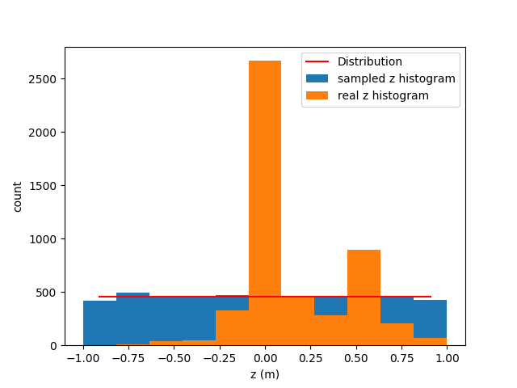

# Documentation of the PyTorch NeuroTrigger Trainer


## Outline
- How to use the tool, start trainings, look at tensorboard, evaluate trainings
- how log is structured
- config keys in detail
- overall software architecture with class diagram
- dataset api, how should the dataset look
- future plans
- how do specific bits work: weight sampler, filter, training of experts, logging/tensorboard


## Introduction


## Cloning and Setup
Note that this setup is only meant for Linux-based system. Other OSes are currently not supported.

In order to clone the repository use the following command:
```bash
git clone git@stash.desy.de:7999/b2nnt/nnt-pytorch.git neuro-trigger-v2
```
Then `cd` into the repository, create a python virtual environment:
```bash
cd neuro-trigger-v2
virtualenv venv --python=python3.8
```
Activate the virtual environmnet and install the dependencies:
```bash
source venv/bin/activate
pip install -r requirements.txt
```
If you later want to deactivate the virtual environment type `deactivate`.

## Start a Training
In order to start a training one first needs to define or choose a training configuration in [`neuro_trigger/configs.py`](neuro_trigger/configs.py). How to do this will be discussed in a later section.
There are several confgurations already defined. For example `baseline_v2` which is the baseline network from BASF2.
To train it run the following commands inside the `neuro_trigger` folder:
```shell
# activate the virtual environment if you haven't already
source venv/bin/activate
# set the python path
export PYTHONPATH="$PYTHONPATH:."
# execute a training
python neuro_trigger/main.py baseline_v2 -p
```
The `-p` argument stands for production and means that no debugging is currently performed. This will ask you to provide a short description for your
experiment to let you remeber it easier and then it will start training with the parameters specified in the configuration that was passed as the first argument.


`main.py` is the main entry point for each training and has a minimal CLI which supports the following arguments:
TODO: remake
```bash
usage: main.py [-h] [-p] mode

Tool to start the neuro trigger training.

positional arguments:
  mode              config mode to use, must be defined in config.py

optional arguments:
  -h, --help        show this help message and exit
  -p, --production  if not given code will run in debug mode
```
The main purpose of this CLI is to pass the configuration that one wants to use for the training.


## Debug Trainings

In order to launch a debug training you can just leave out the `-p` argument. Doing so will also result no description prompt:
```shell
# debug run:
# activate the virtual environment if you haven't already
source venv/bin/activate
# set the python path
export PYTHONPATH="$PYTHONPATH:."
# execute a training
python neuro_trigger/main.py baseline_v2
```
The difference compared to production trainins is that the debug training per default only uses one expert. This is useful for debugging
as we only have a sinlge thread where we can concentrate. The other difference is that the log folder is located under `/tmp/nt_pytorch_debug_log/<config_name>/version_x` instead of in the `log` folder.

If you use VSCode for development and debugging you can also go into the "Run and Debug" tab where you will find two run configurations: one for training clalled "Training" and one for testing called "Tests".

The run configurations are defined in the `.vscode`. They will automatically confiure the path and virtual env correctly.
They also support debugging breakpoints set in VSCode.

The "Training" run configuration uses `normal_distribution` as pre-set config. However, this can easily be changed in [`.vscode/launch.json`](.vscode/launch.json) under `args`.


## Tests

The project also supports the execution of unit tests. The tests are defined in [`neuro_trigger_tests/test.py`](neuro_trigger_tests/test.py). Every method starting with `test_` in a class subclassing from `unittest.TestCase` will be executed.

Note that running the tests can take a few minutes as some end-to-end tests take quite a bit of time
to finish.
To execute the tests run the following command:
```shell
python neuro_trigger/tests/test.py
```
As for the debug trainings, there is also a VSCode run configuration in [`.vscode/launch.json`](.vscode/launch.json) which allows you to run and debug the tests
in VSCode's "Run and Debug" tab. The configuration is named "Tests".


TODO: Explain unit test framework?


## Log

Each training will create a log folder which one can find under the following path for production trainings:
```shell
log/<config name e.g. baseline_v2>/version_x
```
How the 

- tensorboard: plots
- plots
- csv: outcome
- summary.json: outcome + hparams
- log log -> log of trainings run
- git hash, git diff
- resulting datasets


## Evaluate trainings


## Config
(TODO: should also be possible to hand over a handcrafted config python dictionary)
A training is usally configured using `configs` dictionary in the [configs.py](neuro_trigger/configs.py) file.
A configuration is represented by an entry in the dictionary.
The key should be a string which describes the training's configuration.
This key can later be used in [main.py](neuro_trigger/main.py) as described in the section "Start a Training" to run a training with the specified config.

Following configuration items are supported:
* `version` (float): Version number of the training.
* `description` (str): A textual description of the config.
* `learning_rate` (float): Learning rate for the provided optimizer.
* `batch_size` (int): Batch size for each expert.
* `weight_decay` (float): L2 regularization for supported optimizers.
* `in_size` (int): Input size of the network, currently only 27 is supported.
* `out_size` (int): Network's output size. Currently supported are 2 and 1. 2 means that both z and theta are trained on and 1 means that the network is only trained on **z**.
* `workers` (int): Worker processes for dataloading. As the dataset is rather small in our usecase this should rather be a conservative number e.g. less than five.
* `epochs` (int): For how many epochs should each expert train.
* `model` (str): Network model to use. Model strings are defined in [__init__.py](neuro_trigger/__init__.py).
* `loss` (str): Loss function to use for the training. Loss function strings are defined in [__init__.py](neuro_trigger/__init__.py).
* `optim` (str): Optimizer class to use. Optimizer string definitions are defined in [__init__.py](neuro_trigger/__init__.py) and [lightning/pl_module.py](neuro_trigger/lightning/pl_module.py) in function `configure_optimizers`.
* `act` (str): Activation function that should be used in the model. The activation function strings are defined in [__init__.py](neuro_trigger/__init__.py).
* `experts` (List[int]): This list defines which experts one wants to train. For example `[0, 1, 2, 3, 4]` means to train all experts and `[1]` means to only train the expert 1. There is one special case: `[-1]` means to train the data of all experts in one big training, so there will be no expert differentiation then. This is mostly used for debug purposes as there is less multi threading invoved in that case.
* `compare_to` (Optional[str]): Path to the log folder of a previous training to which one wants to compare this training. This is used for metrics which for example compare the loss of the current training to a loss of an old training. It is assumed that all trainings are located in a folder called `log`. Thus the path should be relative to this log-folder. For example one wants to compare to the training which has its log file in `log/baseline_v2/version_3` then `compare_to = "baseline_v2/version_3"`. Default `None` which compares to the old training values hard coded into the dataset.
* `load_pre_trained_weights` (Optional[str]): Every training saves the trained weights into a `weights.json`. This option allows to load theses weights and continue training from them instead of reinitializing the weights again. The passed string should be the path to the respective json file e.g. `log/baseline_v2/version_7/weights.json`. Default is `None` which means that the weights are randomly initialized.
* `filter` (str): Filter that should be applied to the dataset. Filters are defined in [pytorch/dataset_filters.py](neuro_trigger/pytorch/dataset_filters.py). To specifiy the filters one has to use valid python code that produces objects of the classes defined in `dataset_filters.py`. Examples:
  * `dataset_filters.DuplicateEventsFilter()`
  * `dataset_filters.ConCatFilter([dataset_filters.Max2EventsFilter(), dataset_filters.DuplicateEventsFilter()])`
* `dist` (Dict): Used for reweighted datasampling as described in Section `TODO`. It splits the z-interval into `n_buckets` and samples the training batches according to a given stocatstical distribution out of the buckets. This configuration item consists of a dictionary itself with the following items:
  * `n_buckets` (int): How many buckets shall be used for the distribution.
  * `inf_bounds` (bool): Whether the distribution should continue beyoned the lower most bucket to -inf and upper most bocket to inf. This has the side effect that these buckets have a slightly higher probability in the normal distribution as they should have as they include the edge probabilities. When set to False the edge which is not contained in the buckets is excluded and probabilites are normalized. Defaults to False.
  * Distribution type, supported are `norm` and `uniform`.
    * `norm` is a normal distribution. It self is again a dictionary with the following supported parameters:
      * `mean` (float): Mean of the normal distribution
      * `std` (float): Standard diviation of the normal distribution
    * `unform` is a uniform distribution. It self is again a dictionary with the following supported parameters:
      * `lower` (float): lower bound of the normal distribution
      * `upper` (float): upper bound of the normal distribution
  * Examples can be seen in the "Examples" Section below.
* `expert_x` (Dict): where `x` is element of {0, 1, 2, 3, 4} allows to set configuration parameters for specific experts. The parameters can be any of the ones mentioned before. If a parameter is configured twice then this value will overwrite the global value.
* `extends` (str): Training configs have the concept inheritence, this means that once you extend a config, all parameters are inherited from that config. If parameters are configured twice the extending config will overwrite the parameters. The `extends` parameters specifies from which configuration this configuration should inhert. Inheritance is recersive which means that the configuration from which you are inheriting might also inherit from another configuration. This allows us to specify a base configuration which contains the default parameters.


TODO: per expert overwrite, concept of inheritance and base log
TODO: how does random initialization work

### Example Configurations

```python
configs = {
    "base": {
        "version": 0.2,
        "description": "Base version to inherit from",
        "learning_rate": 1e-3,
        "batch_size": 2048,
        "weight_decay": 1e-6,
        "in_size": 27,
        "out_size": 2,
        "workers": 5,
        "epochs": 10,
        "model": "BaselineModel",
        "loss": "MSELoss",
        "optim": "Adam",
        "act": "relu",
        "experts": [0, 1, 2, 3, 4],
        "compare_to": None,
        "load_pre_trained_weights": None,
    }
    "reweight_normal": {
        "extends": "base",
        "compare_to": "baseline_v2/version_4",
        "description": "Normal reweighting",
        "dist": {
            "n_buckets": 11,
            "inf_bounds": False,
            "norm": {
                    "mean": 0,
                    "std": 0.4,
                },
            },
        "act": "tanh/2",
        "epochs": 1000,
        "expert_3": {
            "batch_size": 128,
            "epochs": 2000,
        },
        "expert_4": {
            "batch_size": 16,
            "epochs": 4000,
        },
    },
    "reweight_uniform": {
        "extends": "reweight_normal",
        "description": "Uniform reweighting",
        "dist": {
            "n_buckets": 11,
            "uniform": {
                    "lower": -1,
                    "upper": 1,
                },
            },
        "filter": "dataset_filters.DuplicateEventsFilter()",
    },
}
```

## Extensability

### Software Architcture
The overall software architecture is shown as a class diagramm in the following figure.


There are three prebuild ways to extend the architecture in an easy manner:
- add new tensorboard plots
- add new dataset filters
- add new neural network models
All of these extension ways will be discussed in detail in the following sections.

TODO: specific parts and general flow


### Project Folder Structure
The repository is structured in the following way:
The folder [docs](docs) contains files relevant for this readme documentation such the UML diagram.
[.vscode](.vscode) contains configuration files for the development in visual studio code.
[changelog.md](changelog.md) contains already implemented and planned features which should be realized in specific release versions.
[requirements.txt](requirements.txt) contains the python dependencies for the python code.
[neuro_trigger](neuro_trigger) is the python module which contains the actual python code.
It self is split into
- the [lightning module](neuro_trigger/lightning) which contains code that uses pytorch lightning features such as the pytroch lightning module
- the [pytorch module](neuro_trigger/pytorch) which contains pytorch relevant code such as the network models or the dataloader
- the [test module](neuro_trigger/test) which contains tests code in order to quickly check for easy-to-find bugs
Furthermore, the neuro_trigger also contains the [config.py](neuro_trigger/config.py) file which contains all training configs that can be used for training the neuro trigger. The [main.py](neuro_trigger/main.py) which contains the command line interface and code to start the training.
The [utils.py](neuro_trigger/utils.py) contains helper funcitons and that like.
Fiannly, the [visualize.py](neuro_trigger/visualize.py) contains code for the plots send to tensorboard.


## Visualization
TODO: adapt dia UML to the new schema
The [visualize module](neuro_trigger/visualize.py) can be extended with new plots which can be displayed in tensoboard.
In order to create a new plot the class `NTPlot` in [visualize.py](neuro_trigger/visualize.py) has to be subcallsed and the
`create_plot` method must be overriden. It gets the following arguments:
- `y` (torch.tensor): the networks output, usally z and theta (however only z if only trained on z)
- `y_hat` (torch.tensor): ground truth, values of z and theta that we trian on
and is expexted to return
- matplotlib.figure.Figure: A matplotlib figure object. One can get this object for example with `matplotlib.pyplot.subplots`
- str: A name which identifies the respecive plot

A minimal example for a z histogram can be seen below:
```python
class HistPlot(NTPlot):
    def create_plot(self, y: torch.tensor, y_hat: torch.tensor):
        fig, ax = plt.subplots(dpi=200)
        y_hat = y_hat[:, 0].numpy()
        ax.hist(y_hat, bins=100)
        ax.set(xlabel="Neuro Z")
        return fig, "z-hist"
```
TODO: how to add plots to the process: attribute list

## Filtering
- how does it work
- how can one extend it

Dataset filters are a convient way to apply filter function to the dataset and thus only train on a subset of the data which contains certain specified features..
Dataset filters are located in [dataset_filters.py](neuro_trigger/pytroch/dataset_filters.py).
In order to add new filters one has to subclass the `Filter` class and at least implement the `fltr` method which takes
`data` (Dict[str, torch.Tensor]) as only argument which will contain the the whole dataset in dictionary form as loaded by the `BelleIIDataManager` class.
The method is required to return a torch.Tensor which represents a boolean mask with the entries set to true that are ought to be kept and the
rest set to false.
This allows one to use numpy array / pytorch tensor comparinson syntax.

The following example keeps only samples where z is postive:
```python
class PositiveZFilter(Filter):
    def fltr(self, data: torch.Tensor) -> torch.Tensor:
        z_data = data['x'][:,0]
        return z_data > 0
```
If it is more convinient to produce an array which contains the indexes of the elements that should be kept in the filter, the
`index2mask_array` method can be used to convert the array to a boolean mask. It takes the index array and the length as input and returns the mask array.
The following example filters out all odd indexes and thus halves the dataset using `index2mask_array`:

```python
class EvenFilter(Filter):
    def fltr(self, data: torch.Tensor) -> torch.Tensor:
        r = np.arange(len(data['x']))
        mask = r % 2 == 0
        keep_idxs = r[mask]
        return index2mask_array(keep_idxs, len(data['x']))
```
Note that boolean arrays can be negated using the `~` operator. E.g. `~a` inverts all entries in `a` if `a` is a boolean array.

Filters can be combined using the `ConCatFilter` and the dataset length can be limited e.g. for developing using the `RangeFilter`. For details see the Config section.


## Model
- how to create new models

## Reweighting

### Uniformly


### With Normal Distribution

