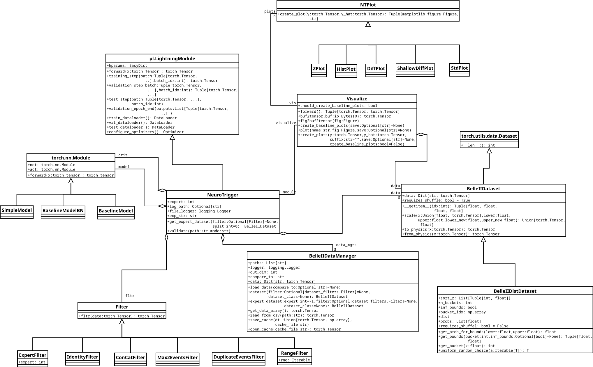

# Documentation of the PyTorch NeuroTrigger Trainer


## Outline
- How to use the tool, start trainings, look at tensorboard, evaluate trainings
- how log is structured
- config keys in detail
- overall software architecture with class diagram
- dataset api, how should the dataset look
- future plans
- how do specific bits work: weight sampler, filter, training of experts, logging/tensorboard


## Introduction


## Cloning and Setup
Note that this setup is only meant for Linux-based system. Other OSes are currently not supported.

In order to clone the repository use the following command:
```bash
git clone git@stash.desy.de:7999/b2nnt/nnt-pytorch.git neuro-trigger-v2
```
Then `cd` into the repository, create a python virtual environment:
```bash
cd neuro-trigger-v2
virtualenv venv --python=python3.8
```
Activate the virtual environmnet and install the dependencies:
```bash
source venv/bin/activate
pip install -r requirements.txt
```
If you late want to deactivate the virtual environment type `deactivate`.

## Start a Training
In order to start a training one first needs to define or choose a training configuration in `neuro_trigger/configs.py`. How to do this will be discussed in a later section.
There are several confgurations already defined. For example `baseline_v2` which is the baseline network from BASF2.
To train it run the following commands inside the `neuro_trigger` folder:
```shell
# activate the virtual environment if you haven't already
source venv/bin/activate
# set the python path
export PYTHONPATH="$PYTHONPATH:."
# execute a training
python neuro_trigger/main.py baseline_v2 -p
```
The `-p` argument stands for production and means that no debugging is currently performed. This will ask you to provide a short description for your
experiment to let you remeber it easier and then it will start training with the parameters specified in the configuration that was passed as the first argument.

`main.py` is the main entry point for each training and has a minimal CLI which supports the following arguments:
```bash
usage: main.py [-h] [-p] mode

Tool to start the neuro trigger training.

positional arguments:
  mode              config mode to use, must be defined in config.py

optional arguments:
  -h, --help        show this help message and exit
  -p, --production  if not given code will run in debug mode
```
The main purpose of this CLI is to pass the configuration that one wants to use for the training.


## Debug Trainings

In order to launch a debug training you can just leave out the `-p` argument. Doing so will also result no description prompt:
```shell
# debug run:
# activate the virtual environment if you haven't already
source venv/bin/activate
# set the python path
export PYTHONPATH="$PYTHONPATH:."
# execute a training
python neuro_trigger/main.py baseline_v2
```
The difference compared to production trainins is that the debug training per default only uses one expert. This is useful for debugging
as we only have a sinlge thread where we can concentrate. The other difference is that the log folder is located under `/tmp/nt_pytorch_debug_log/<config_name>/version_x` instead of in the `log` folder.

If you use VSCode for development and debugging you can also go into the "Run and Debug" tab where you will find two run configurations: one for training clalled "Training" and one for testing called "Tests".

The run configurations are defined in the `.vscode`. They will automatically confiure the path and virtual env correctly.
They also support debugging breakpoints set in VSCode.

The "Training" run configuration uses `normal_distribution` as pre-set config. However, this can easily be changed in `.vscode/launch.json` under `args`.


## Tests

The project also supports the execution of unit tests. The tests are defined in `neuro_trigger_tests/test.py`. Every method starting with `test_` in a class subclassing from `unittest.TestCase` will be executed.

Note that running the tests can take a few minutes as some end to end tests take quite a bit of time
to finish.
To execute the tests run the following command:
```shell
python neuro_trigger/tests/test.py
```
As for the debug trainings, there is also a VSCode run configuration in `.vscode/launch.json` which allows you to run and debug the tests
in VSCode's "Run and Debug" Tab. The configuration is named "Tests".


TODO: Explain unit test framework?


## Log

Each training will create a log folder which one can find under the following path for production trainings:
```shell
log/<config_name e.g. baseline_v2>/version_x
```
How the 

- tensorboard: plots
- plots
- csv: outcome
- summary.json: outcome + hparams
- log log -> log of trainings run
- git hash, git diff
- resulting datasets


## Evaluate trainings


## Config


## Software Architcture
The overall software architecture is shown as a class diagramm in the following figure.



TODO: specific parts and general flow
- folder structure


## Reweighting
### Uniformly
### With Normal Distribution